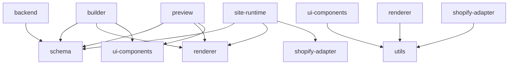

# Jackery Atlas 详细实施计划 (Monorepo 版)

> **目标**: 以 Monorepo 形式实现 Builder/Preview/Site-runtime、后端 Java API，以及 schema/渲染等共享组件，支撑 MVP 的前后端协同开发
> **验收标准**: 页面可被搜索、Checkout 跳转 Shopify、最终产物为静态输出、Lighthouse ≥ 95
>
> **⚠️ 架构版本注意**: 本文档部分目录描述基于早期规划。最新工程结构请以 [07_平台与站点工程边界（MVP方案A）.md](../02_technical_architecture/07_平台与站点工程边界（MVP方案A）.md) 为准。以下目录结构已更新以匹配最新架构。

---

## 1. 项目现状分析

### 1.1 当前技术状态
- ✅ **Schema 定义完成度**: 80% (169行 TypeScript 类型定义)
- ✅ **架构设计完成度**: 95% (详细技术文档 + 完整规划)
- ✅ **文档体系完成度**: 90% (54个 Markdown 文档)
- ❌ **代码实现完成度**: 5% (仅有 Schema 定义)
- ❌ **基础设施完成度**: 0% (无 package.json、构建配置)

### 1.2 技术栈确认
- **前端**: Vue 3 + Nuxt 3 + TypeScript + TailwindCSS + Pinia
- **后端**: Java + Spring Boot + PostgreSQL + JSONB
- **构建**: PNPM + Turborepo + Vite
- **部署**: AWS ECS + S3 + CloudFront
- **设计**: Google Stitch + Pro-Dark Industrial 设计系统

### 1.3 团队配置
- **规模**: 3-5人中型团队
- **分工**: 前端架构师 x1, Vue开发者 x1-2, 后端开发者 x1, DevOps x1

---

## 2. Monorepo 架构设计

### 2.1 完整目录结构
```
Atlas/
├── apps/                           # 平台应用层
│   ├── atlas-builder/              # 可视化编辑器 (Vue 3 SPA)
│   │   ├── src/
│   │   │   ├── components/
│   │   │   ├── stores/
│   │   │   └── utils/
│   │   ├── package.json
│   │   └── vite.config.ts
│   ├── atlas-admin/                # 平台管理后台
│   └── atlas-api/                  # Java API 服务 (或独立 Repo)
│       ├── src/main/java/
│       │   ├── config/
│       │   ├── controller/
│       │   ├── service/
│       │   └── repository/
│       └── pom.xml
├── packages/                       # 共享核心包
│   ├── atlas-sdk/                  # 平台 SDK (Hooks/Types)
│   ├── schema/                     # Schema 定义 (已有)
│   │   ├── src/
│   │   │   └── shopify-compatible.ts
│   │   └── index.ts
│   └── publisher/                  # 构建与发布 Worker (Node)
│       ├── src/
│       │   ├── renderer.ts
│       │   └── worker.ts
│       └── package.json
├── themes/                         # 主题工程 (按品牌/体系)
│   ├── jackery-v1/
│   │   ├── components/
│   │   └── theme.json
│   └── package.json
├── features/                       # 能力包 (可插拔)
│   ├── commerce/
│   ├── tracking/
│   └── cookie-consent/
└── sites/                          # 站点实例配置 (无业务代码)
    ├── jackery-us/
    │   └── config.json
    └── jackery-jp/
        └── config.json
```

### 2.2 依赖关系图


---

## 3. 分阶段实施计划

### Phase 1: 基础设施搭建 (Week 1)

#### Day 1-2: Monorepo 初始化
```bash
# 根目录配置
- package.json (workspace配置)
- pnpm-workspace.yaml
- turbo.json
- .gitignore + .editorconfig

# Schema 包完善
- packages/schema/package.json
- packages/schema/index.ts (导出所有类型)
- packages/schema/tsconfig.json
- packages/schema/package.json
```

#### Day 3-4: 应用框架搭建
```bash
# Builder 应用 (Vue 3 SPA)
apps/builder/
├── package.json
├── vite.config.ts
├── tsconfig.json
├── tailwind.config.js
└── src/
    ├── main.ts
    ├── App.vue
    └── components/
        ├── Canvas/
        ├── PropertyPanel/
        └── ComponentList/

# Preview 应用 (Vue 3)
apps/preview/
├── package.json
├── vite.config.ts
└── src/
    ├── main.ts
    └── components/

# Site Runtime 应用 (Nuxt 3)
apps/site-runtime/
├── package.json
├── nuxt.config.ts
└── pages/
    ├── index.vue
    └── products/[handle].vue
```

#### Day 5-7: 开发环境配置
```bash
# 工具链配置
- ESLint + Prettier
- Husky + lint-staged
- TypeScript 严格模式
- 绝对导入配置
- Git hooks 配置
```

**验收标准**:
- [ ] Monorepo 可正常启动 (`pnpm install` 成功)
- [ ] 三个应用的最小模板能启动 (`pnpm dev`)
- [ ] ESLint/Prettier 规范通过
- [ ] TypeScript 编译无错误

### Phase 2: 核心功能开发 (Week 2-3)

#### Week 2: 渲染引擎 + 基础 Builder
```typescript
// packages/renderer/src/
├── component-factory.ts    // 动态组件创建
├── schema-parser.ts        // Schema 解析
├── vue-renderer.ts         // Vue 渲染逻辑
└── types.ts                // 渲染相关类型

// apps/builder/src/
├── components/
│   ├── Canvas/             // 画布区域
│   │   ├── Canvas.vue
│   │   └── PreviewFrame.vue
│   ├── PropertyPanel/      // 属性面板
│   │   ├── PropertyPanel.vue
│   │   └── DynamicForm.vue
│   └── ComponentList/      // 组件列表
│       ├── ComponentList.vue
│       └── DraggableItem.vue
├── stores/
│   └── editor.ts           // Pinia 状态管理
└── utils/
    └── postmessage.ts      // 跨框架通信
```

#### Week 3: 可视化编辑核心
```typescript
// 核心功能实现
- 拖拽系统 (VueDraggable)
- 属性面板动态渲染
- 跨 Frame 通信
- 组件选中高亮
- 撤销/重做机制
```

**验收标准**:
- [ ] JSON Schema 能被渲染为基础 Vue 组件
- [ ] Builder 可新增/删除/排序组件
- [ ] 属性面板可编辑字段并实时预览
- [ ] 跨 Frame 通信正常工作

### Phase 3: 业务集成 (Week 4-5)

#### Week 4: Shopify 集成
```typescript
// packages/shopify-adapter/src/
├── storefront-api.ts       // Storefront API 封装
├── product-picker.ts       // 产品选择器
├── cart-manager.ts         // 购物车管理
└── types.ts                // Shopify 相关类型

// 核心功能
- Product Picker 组件
- 产品信息数据绑定
- 图片/价格/标题动态更新
```

#### Week 5: 电商闭环
```typescript
// 购物车系统
- 本地状态管理 (LocalStorage)
- Shopify Cart API 集成
- 乐观 UI 更新
- Checkout 跳转
- SEO 三件套 (title/description/OG)
```

**验收标准**:
- [ ] 产品数据可从 Shopify 动态绑定
- [ ] 购物车功能完整可用
- [ ] Checkout 正常跳转 Shopify
- [ ] Lighthouse (移动端) ≥ 95

### Phase 4: 后端 + 部署 (Week 6-7)

#### Week 6: Java 后端 API
```java
// apps/backend/src/main/java/
├── config/                 // 配置类
│   ├── DatabaseConfig.java
│   └── SecurityConfig.java
├── controller/             // REST 控制器
│   ├── PageController.java
│   ├── SchemaController.java
│   └── PublishController.java
├── service/                // 业务逻辑
│   ├── PageService.java
│   └── PublishService.java
├── repository/             // 数据访问
│   └── PageRepository.java
└── model/                  // 数据模型
    ├── Page.java
    └── Section.java
```

#### Week 7: 部署配置
```yaml
# CI/CD 流水线
.github/workflows/
├── ci.yml                  # 持续集成
├── deploy-frontend.yml     # 前端部署
└── deploy-backend.yml      # 后端部署

# Docker 配置
infra/docker/
├── Dockerfile.frontend
├── Dockerfile.backend
└── docker-compose.yml
```

**验收标准**:
- [ ] Java API 服务可正常启动
- [ ] 数据库连接和基础 CRUD 可用
- [ ] CI/CD 流水线可执行
- [ ] 生产环境部署成功

### Phase 5: 测试与优化 (Week 8)

#### 测试策略
```typescript
// 测试覆盖
- 单元测试 (Vitest)
- 集成测试 (Playwright)
- E2E 测试
- 性能测试 (Lighthouse)
```

#### 性能优化
```typescript
// 优化项目
- 代码分割和懒加载
- 图片优化和 WebP
- 关键 CSS 内联
- Service Worker 缓存
```

**验收标准**:
- [ ] 所有测试通过 (覆盖率 ≥ 80%)
- [ ] Lighthouse (移动端) ≥ 95
- [ ] 页面加载速度 < 3秒
- [ ] 构建后无 Node Runtime 依赖

---

## 4. 关键配置示例

### 4.1 根目录配置

#### package.json
```json
{
  "name": "jackery-atlas",
  "private": true,
  "workspaces": [
    "apps/*",
    "packages/*"
  ],
  "scripts": {
    "build": "turbo run build",
    "dev": "turbo run dev",
    "lint": "turbo run lint",
    "test": "turbo run test",
    "clean": "turbo run clean"
  },
  "devDependencies": {
    "@typescript-eslint/eslint-plugin": "^6.0.0",
    "@typescript-eslint/parser": "^6.0.0",
    "eslint": "^8.45.0",
    "eslint-config-prettier": "^9.0.0",
    "prettier": "^3.0.0",
    "turbo": "^1.10.0",
    "typescript": "^5.0.0"
  }
}
```

#### pnpm-workspace.yaml
```yaml
packages:
  - 'apps/*'
  - 'packages/*'
```

#### turbo.json
```json
{
  "$schema": "https://turbo.build/schema.json",
  "pipeline": {
    "build": {
      "dependsOn": ["^build"],
      "outputs": ["dist/**", ".next/**"]
    },
    "dev": {
      "cache": false
    },
    "lint": {
      "outputs": []
    },
    "test": {
      "outputs": ["coverage/**"]
    }
  }
}
```

### 4.2 应用配置示例

#### apps/builder/vite.config.ts
```typescript
import { defineConfig } from 'vite'
import vue from '@vitejs/plugin-vue'
import { resolve } from 'path'

export default defineConfig({
  plugins: [vue()],
  resolve: {
    alias: {
      '@': resolve(__dirname, 'src'),
      '@schema': resolve(__dirname, '../../packages/schema/src'),
      '@renderer': resolve(__dirname, '../../packages/renderer/src'),
      '@ui-components': resolve(__dirname, '../../packages/ui-components/src')
    }
  },
  server: {
    port: 3000,
    host: true
  }
})
```

#### apps/site-runtime/nuxt.config.ts
```typescript
export default defineNuxtConfig({
  devtools: { enabled: true },
  modules: ['@nuxtjs/tailwindcss'],
  css: ['~/assets/css/main.css'],
  runtimeConfig: {
    public: {
      shopifyDomain: process.env.SHOPIFY_DOMAIN,
      storefrontToken: process.env.SHOPIFY_STOREFRONT_TOKEN
    }
  },
  alias: {
    '@schema': './packages/schema/src',
    '@renderer': './packages/renderer/src',
    '@shopify-adapter': './packages/shopify-adapter/src'
  }
})
```

---

## 5. 团队分工与协作

### 5.1 角色分配
| 角色 | 人数 | 主要职责 |
|------|------|----------|
| **前端架构师** | 1 | Monorepo 架构、渲染引擎设计、组件库规范 |
| **Vue 开发者** | 1-2 | Builder/Preview 应用开发、UI 组件实现 |
| **后端开发者** | 1 | Java API 开发、数据库设计、部署配置 |
| **DevOps** | 1 | CI/CD 流水线、基础设施、性能优化 |

### 5.2 Git 工作流
```bash
# 分支策略
main (生产)
├── develop (开发)
├── feature/builder-core
├── feature/renderer-engine
├── feature/shopify-integration
└── hotfix/xxx
```

### 5.3 代码审查清单
- [ ] TypeScript 类型安全
- [ ] ESLint 规范通过
- [ ] 测试覆盖率 ≥ 80%
- [ ] 性能指标达标
- [ ] 安全检查通过

---

## 6. 风险控制与应对

### 6.1 技术风险
| 风险 | 影响 | 应对策略 |
|------|------|----------|
| **跨 Frame 通信** | 高 | 备选方案使用事件总线，充分测试 |
| **Schema 驱动渲染** | 中 | 分阶段实现，先支持基础类型 |
| **增量构建性能** | 中 | MVP 期间使用全量构建，后续优化 |

### 6.2 进度风险
| 风险 | 影响 | 应对策略 |
|------|------|----------|
| **需求变更** | 高 | Week 1 定死 Schema 作为契约 |
| **技术阻塞** | 中 | 每日站会，4小时原则必须求助 |
| **集成复杂度** | 中 | 早期集成测试，持续验证 |

### 6.3 质量风险
- **代码规范**: 强制 ESLint + Prettier + Husky
- **类型安全**: TypeScript 严格模式
- **测试覆盖**: 单元测试 + 集成测试 + E2E 测试

---

## 7. 验收标准与检查清单

### 7.1 每周验收标准

#### Week 1: 基础设施
- [ ] Monorepo 可正常启动 (`pnpm install` 成功)
- [ ] 三个应用框架搭建完成
- [ ] 开发环境配置完成 (ESLint/Prettier/TypeScript)

#### Week 2: 渲染引擎
- [ ] 渲染引擎可解析 Schema
- [ ] Builder 基础界面可用
- [ ] Preview 可显示静态组件

#### Week 3: 可视化编辑
- [ ] 可视化编辑核心功能完成
- [ ] 拖拽排序可用
- [ ] 属性面板动态渲染

#### Week 4: Shopify 集成
- [ ] Shopify API 集成完成
- [ ] 产品选择器可用
- [ ] 数据绑定正常

#### Week 5: 电商闭环
- [ ] 购物车功能完整
- [ ] Checkout 跳转正常
- [ ] SEO 优化完成

#### Week 6: 后端 API
- [ ] Java API 服务可用
- [ ] 数据库设计完成
- [ ] 接口文档完整

#### Week 7: 部署配置
- [ ] CI/CD 流水线可用
- [ ] 生产环境部署成功
- [ ] 监控告警配置完成

#### Week 8: 测试优化
- [ ] 所有测试通过
- [ ] Lighthouse ≥ 95
- [ ] MVP 功能验收完成

### 7.2 最终验收标准
- [ ] 非开发人员可完成首页配置与发布
- [ ] 产品页数据来自 Shopify，结构化数据合规
- [ ] Lighthouse (移动端) ≥ 95，关键页面可缓存与预热
- [ ] Checkout 正常跳转 Shopify
- [ ] 发布有审计与回滚；监控与告警生效
- [ ] 构建后无 Node Runtime 依赖

---

## 8. 附录

### 8.1 工具推荐
- **开发工具**: VS Code + Vue 3 插件包
- **设计工具**: Google Stitch + TailwindCSS
- **测试工具**: Vitest + Playwright
- **部署工具**: Docker + GitHub Actions

### 8.2 参考资源
- [Vue 3 官方文档](https://vuejs.org/)
- [Nuxt 3 文档](https://nuxt.com/)
- [Turborepo 最佳实践](https://turbo.build/repo)
- [Shopify Storefront API](https://shopify.dev/docs/storefront-api)

### 8.3 常见问题解答
- **Q: 如何处理跨域问题？**
  A: 开发环境使用 Vite 代理，生产环境使用 CORS 配置

- **Q: 如何保证类型安全？**
  A: 全链路 TypeScript + 严格模式 + 类型导入

- **Q: 如何优化构建性能？**
  A: 代码分割 + 懒加载 + 缓存策略

---

## 9. 下一步行动

### 立即执行 (今天)
1. 创建根目录 `package.json`
2. 初始化 `pnpm-workspace.yaml`
3. 完善 `packages/schema` 包结构

### 本周目标
1. 搭建完整的 Monorepo 基础设施
2. 三个应用的最小框架可启动
3. 开发环境配置完成

### 持续跟踪
- 每日站会同步进度
- 每周回顾验收标准
- 及时识别和解决风险点

---

> **文档版本**: v1.0  
> **最后更新**: 2025-01-16  
> **维护者**: 前端架构师  
> **审核者**: 技术负责人