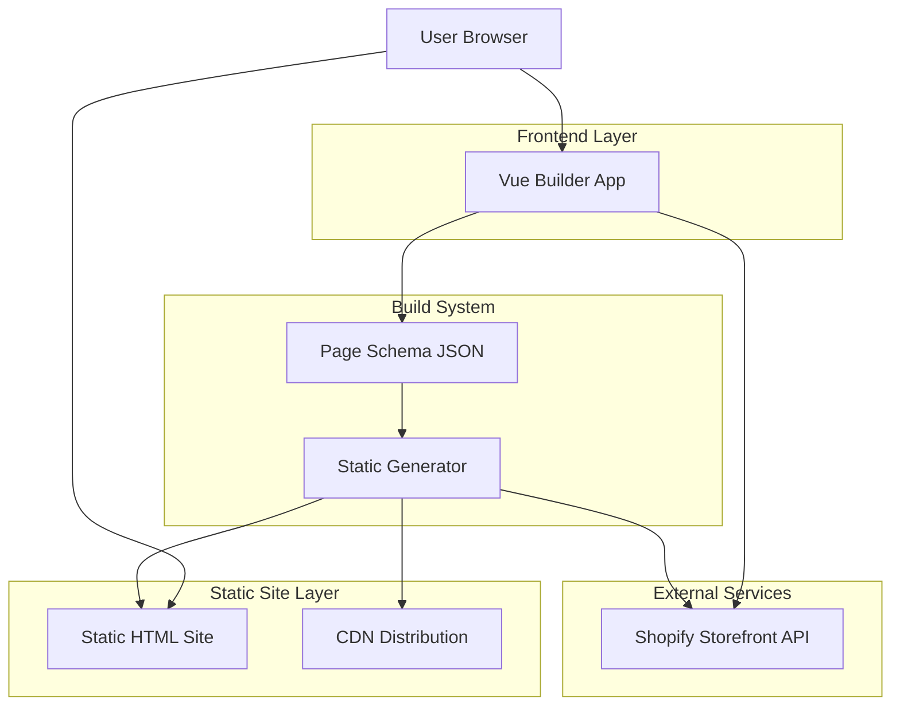
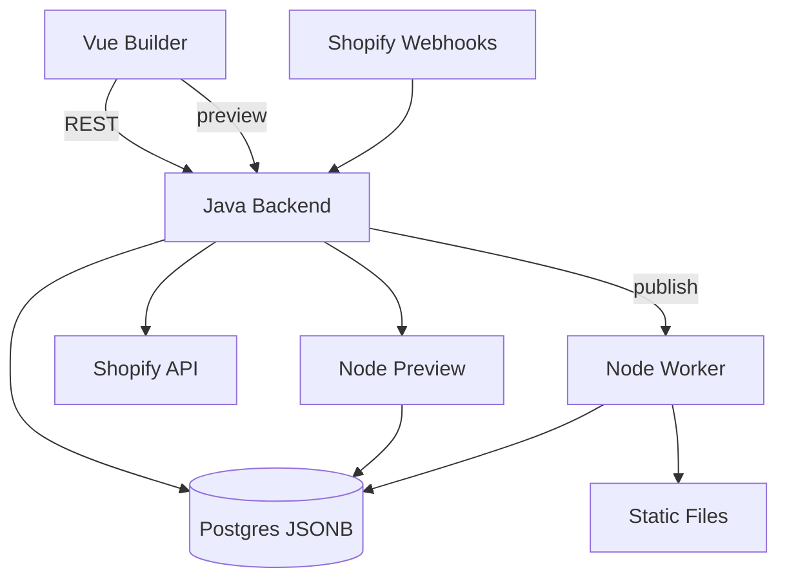
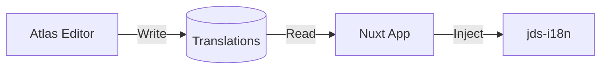

## 1. 架构设计

更多架构图（系统分层/组件/用例/时序/类图/状态/活动/部署）：见 [09\_架构设计图表.md](./09_架构设计图表.md)。
SLA 99.9 与 10000 页规模下的发布体系与默认参数：见 [10\_SLA与发布体系（99.9\_10000页）.md](./10_SLA与发布体系（99.9_10000页）.md)。
多站点多主题（MVP方案A）下的平台/主题/能力包/站点实例边界：见 [07\_平台与站点工程边界（MVP方案A）.md](./07_平台与站点工程边界（MVP方案A）.md)。

### 多站点多主题装配（摘要）
- 站点实例（Site）不是独立代码仓，而是平台中的“配置 + 内容 + 选用版本”的组合：`site_id`、`theme_id@version`、`enabled_features[]`、`content_version`、`config_version`。
- 主题（Theme）负责品牌视觉与页面组件实现；能力包（Feature Pack）负责可插拔业务能力（如 commerce/tracking/cookie-consent）。
- 发布构建（Publisher/Worker）按站点记录解析 `theme@version + features@versions`，装配运行时代码并静态生成不可变产物；回滚等价于回到上一条“完整装配组合版本”。



## 2. 技术描述（MVP: Java + Node）

* 前端：Vue 3 + Nuxt 3 (or Vite) + TypeScript + TailwindCSS + Pinia（Monorepo：apps 与 packages）

* 构建工具：Vite；仓库管理：pnpm + Turborepo（或 Nx）

* **后端 API (Java)**:

  * Framework: Java Backend（Spring Boot 生态）

  * Data: PostgreSQL（JSONB）

  * Auth: OIDC（Keycloak 或企业 SSO）

  * API: REST + OpenAPI

* **渲染与发布 (Node/TypeScript)**:

  * Preview: Node Preview Service（复用 TS 渲染库）

  * Publisher: Node Worker（构建发布，读 DB 写 S3）

* 部署：S3 + CloudFront（静态发布）；ECS Fargate（Java Backend + Node Preview）；Worker 以任务方式运行

## 3. 路由定义

| 路由                | 用途                               |
| ----------------- | -------------------------------- |
| /                 | 首页（静态HTML）                       |
| /products/:handle | 产品详情页（静态HTML）                    |
| /pages/:slug      | 内容页面（静态HTML）                     |
| /editor           | 可视化编辑器 (调用 Java API)             |
| /editor/:pageId   | 特定页面编辑器 (调用 Java API)            |
| /preview/:pageId  | 页面预览 (Java API 转发到 Node Preview) |
| /admin            | 管理后台                             |

## 4. API定义 (MVP)

### 4.1 页面与配置 API（Java）

* 页面与 Schema：/api/pages /api/schemas

* 权限控制：Java RBAC + 审计（必要时配合 DB 约束）

### 4.2 预览 API（Java -> Node）

* Java API 负责鉴权与参数校验，再转发到 Node Preview：/api/preview

### 4.3 发布构建 API（Java -> Node Worker）

* Java API 创建发布任务并触发 Node Worker：/api/publish

### 4.4 Commerce API（Java 代理 Shopify）

* cart checkout order webhook：/api/commerce 与 /api/webhooks

## 5. 服务器架构（MVP: Java + Node）



### 5.1 Commerce 服务职责（Java）

* Cart Service：创建/读取/更新购物车，维护 cartId 与用户会话映射

* Checkout Service：生成 checkout webUrl 并返回给前端跳转；可附加折扣码/备注

* Order Webhook Handler：接收订单创建/支付成功事件，持久化订单摘要并提供查询

* 安全策略：令牌代理、速率限制、审计日志；不处理支付卡信息

## 6. 数据模型 (Shopify Compatible)

Atlas 采用严格兼容 Shopify Theme 2.0 的数据结构，以实现低成本迁移。

### 6.1 Page Instance (DB: `pages` table)

存储页面实例数据，对应 Shopify `templates/*.json`。

```typescript
interface PageInstance {
  id: string;          // UUID
  name: string;        // 页面名称
  sections: Record<string, SectionInstance>; // 扁平化 Section Map
  order: string[];     // Section 渲染顺序
  // ... SEO, status
}
```

### 6.2 Section Instance

对应 Shopify Template JSON 中的 section 对象。

```typescript
interface SectionInstance {
  type: string;        // 组件 Key (e.g. "hero-banner")
  settings: Record<string, any>; // 全局配置
  blocks?: Record<string, BlockInstance>; // 子 Block Map
  block_order?: string[]; // Block 渲染顺序
}
```

### 6.3 Component Definition (Schema)

对应 Shopify Liquid ``，定义组件的配置项结构。

```typescript
interface ComponentDefinition {
  type: string;
  name: string;
  settings: SettingDefinition[];
  blocks?: BlockDefinition[];
  presets?: PresetDefinition[];
}
```

详细定义请参考：[07\_Schema设计规范\_Shopify兼容版.md](./07_Schema设计规范_Shopify兼容版.md)

## 7. 多语言架构 (i18n)

Atlas 采用 **Config Center** 模式管理多语言，兼容 `jds-i18n` 运行时。

### 7.1 架构图



### 7.2 核心流程

1. **定义 (Schema)**: 开发者在 `TranslationSchema` 中定义翻译键（Label, Type, Default）。
2. **配置 (Config)**: 运营在编辑器中修改各语言的文案，数据存储在 `site_locale_config` 表中。
3. **消费 (Runtime)**: 应用启动时拉取全量翻译 JSON，注入到 `jds-i18n` 实例中，实现前端渲染。

详细规范请参考：[docs/i18n-management-spec.md](../../docs/i18n-management-spec.md)

## 8. 渲染引擎设计

（JSON→AST→组件树→静态HTML，构建期资源优化）

## 9. 构建与部署（AWS）

* 增量构建：页面哈希、关联重建、并行提升效率

* CDN策略：HTML 短 TTL + 版本号；静态资源内容哈希；API 边缘缓存按需

* CI/CD流程：PR → 测试 → 合并 → 构建 → CDN 部署

## 10. 监控与指标

* 日志：pino（结构化日志）；Trace：OpenTelemetry（OTLP）

* 指标：请求 QPS/延迟/错误率；构建时长/成功率；队列积压与重试

* 健康检查：/health、/metrics；错误告警：CloudWatch/Prometheus 规则

## 11. 技术选型决策 (ADR)

### 11.1 前端框架：Vue 3 + Nuxt 3 vs Shopify Hydrogen

**决策**：坚定选择 **Vue 3 + Nuxt 3**。
**背景**：评估了 Shopify 官方推崇的 Hydrogen (React/Remix) 框架。
**拒绝 Hydrogen 的理由**：

1. **团队匹配度**：团队核心优势在于 Vue 技术栈。切换到 React/Remix 会引入巨大的学习成本，严重拖慢 MVP 交付速度。
2. **架构演进冲突**：本项目长期目标是演进到自研后端（去 Shopify 化）。Hydrogen 与 Shopify Storefront API 深度耦合，未来迁移成本极高（需重写前端）。Vue 方案保持了架构的松耦合，仅需替换 API 层即可对接 Java 自研后端。
3. **通用性**：Nuxt 3 生态更通用，适合构建复杂的 Headless Builder 和 CMS 系统，而 Hydrogen 专注于纯电商场景。

### 11.2 后端演进：Java 对外入口 + Node 渲染发布

**演进路线**：

* **Phase 1 (MVP)**：Java 作为对外唯一入口，Node 负责预览与构建发布。

  * **atlas-api**: Java REST + OpenAPI（鉴权、审计、RBAC）

  * **atlas-storage**: PostgreSQL JSONB

  * **atlas-commerce**: Java 代理 Shopify API + Webhook 入库

  * **preview publisher**: Node TypeScript（复用渲染库）

* **Phase 2 (Scale)**：引入队列与缓存以提升并发与可靠性。

  * Java 产出发布任务，Node Worker 消费执行

  * Redis 与 Queue Event 用于去抖、重试、幂等与编排

* **Phase 3 (Enterprise)**：按需拆分服务与插件沙箱，保持前台纯静态交付不变。

## 12. 性能与缓存

* 构建优化：代码分割、图片优化、关键 CSS

* 运行时优化：静态 HTML 直出、CDN 图片优化、字体预加载

* 缓存策略：浏览器长缓存、CDN 边缘缓存、Service Worker
