# Jackery Atlas 架构设计（前后分离：前端 Monorepo + 后端 Java + Node）

## 演示精选（30分钟建议顺序）
1. 系统整体分层架构图（讲“谁对公网、谁内网、数据流”）
2. 构建与发布管线时序图（讲“jobId 异步 + 版本化产物 + 原子切换 + 回滚”）
3. 权限与审计/发布治理相关图（讲“单入口治理、可追溯”）
4. Schema/内容模型相关图（讲“Schema First + Shopify Compatible”）
5. 全局组件批量发布相关图（答疑用：Header/Footer/Cookie Banner）

## 系统整体分层架构图

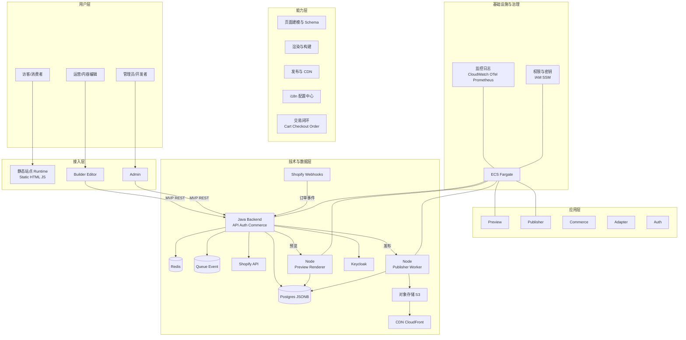

## 组件图（逻辑模块与边界）

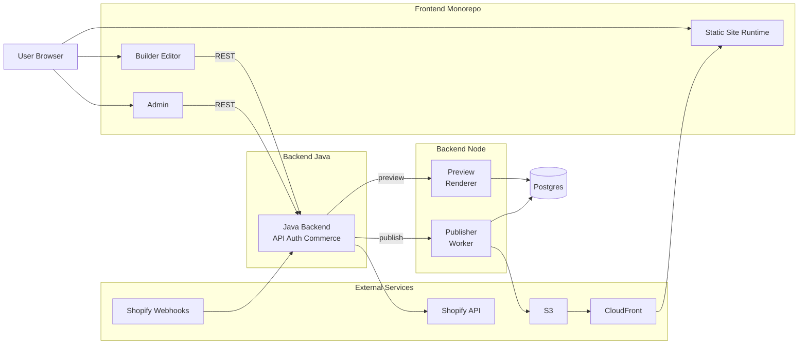

## 前后端分离图（分离点与连接点）

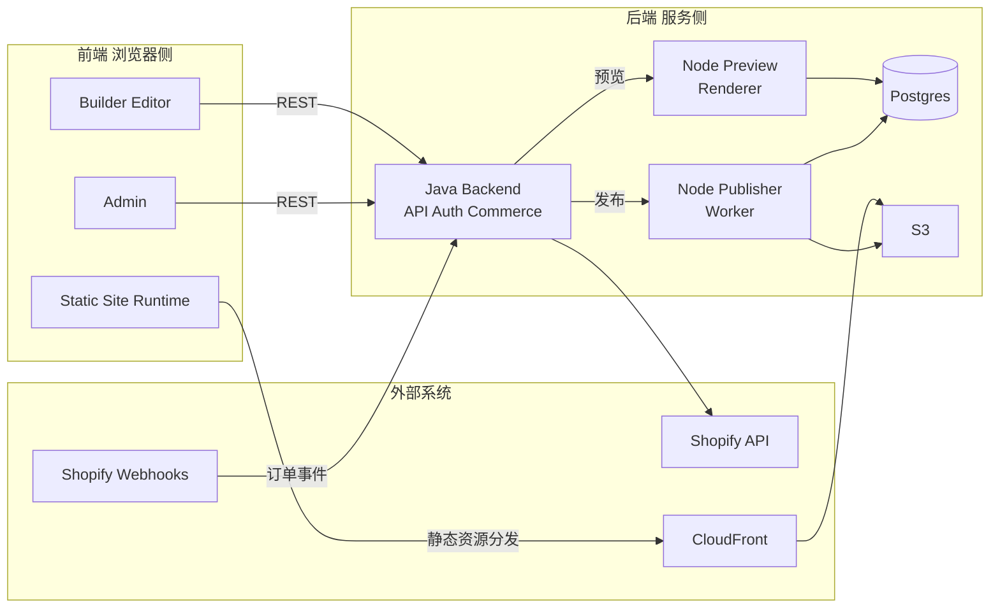

## 用例图（核心用例）

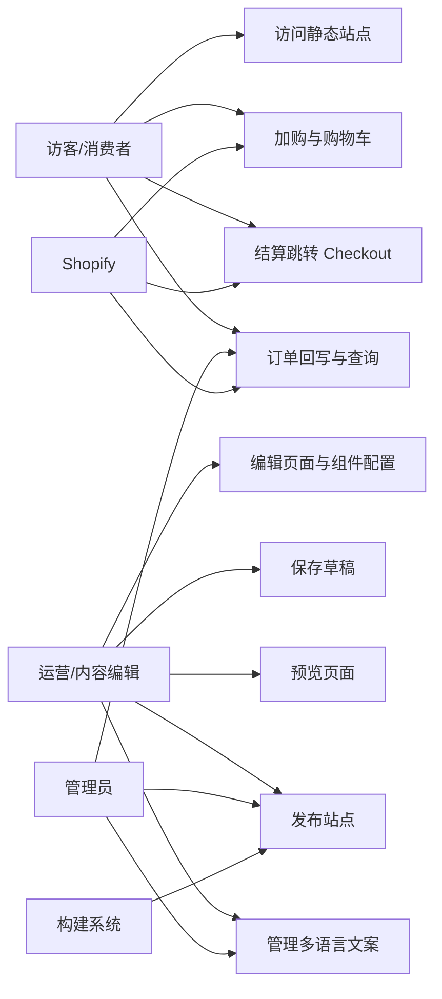

## 时序图

### 编辑保存（MVP: Java API + DB）

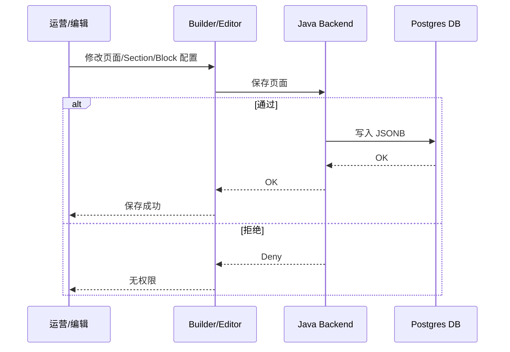

### 预览（MVP: Java API + Node Preview）

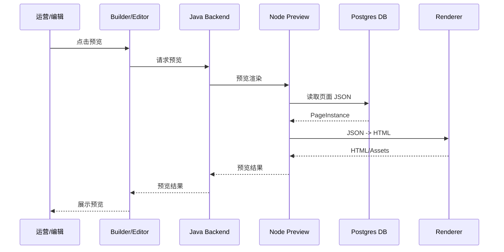

### 发布（Java 触发 -> Node Worker -> S3 -> CDN）

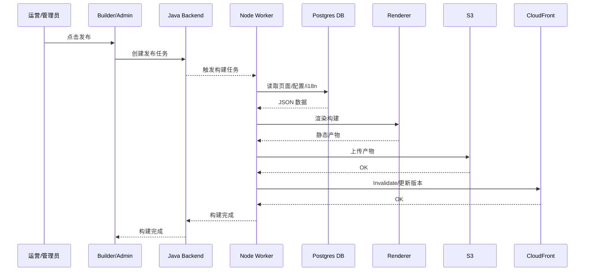

### 交易闭环（Cart/Checkout + Webhook 回写）

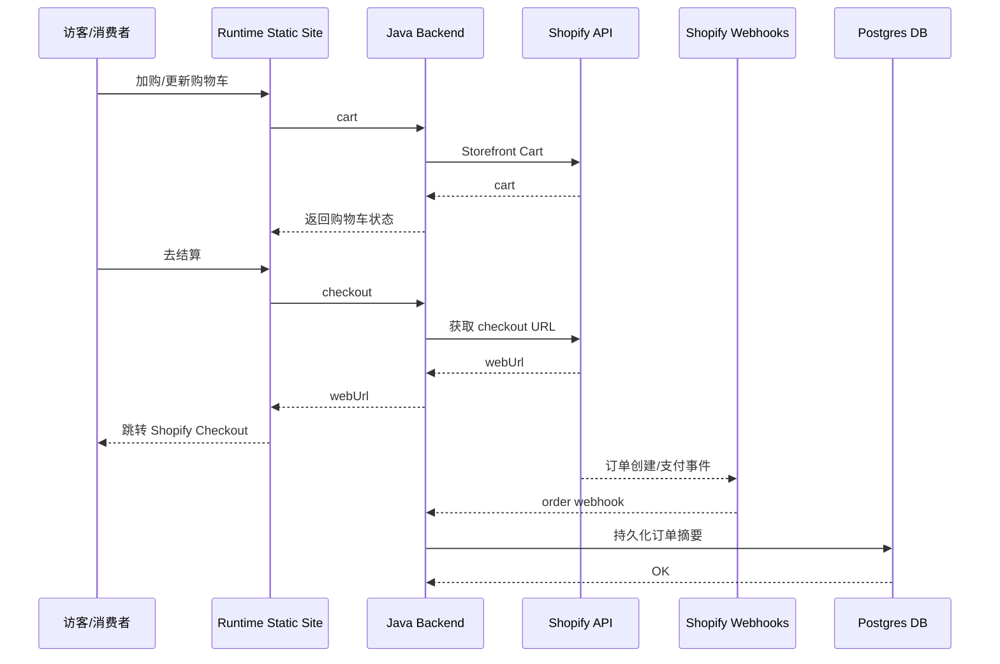

## 类图（核心数据与Schema）

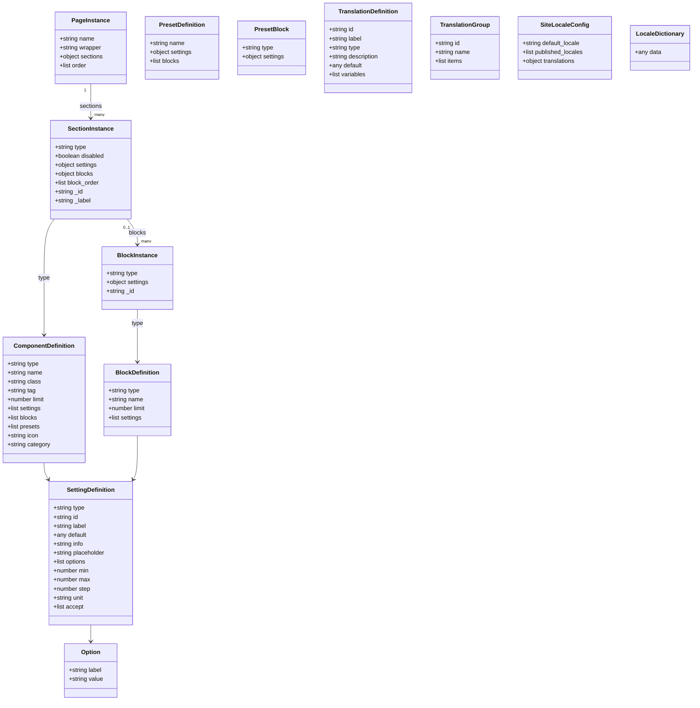

## 状态图

### 页面生命周期（草稿/发布/归档）

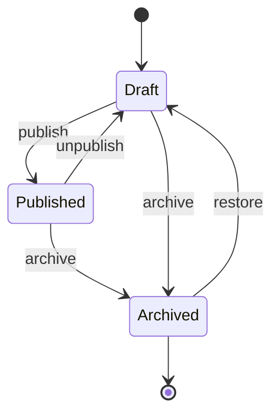

### 构建与发布状态（队列/构建/部署）

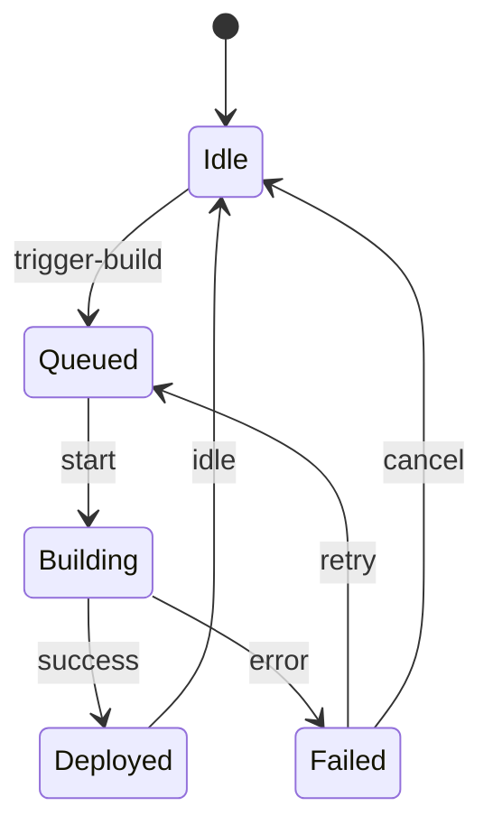

## 活动图（发布流水线）

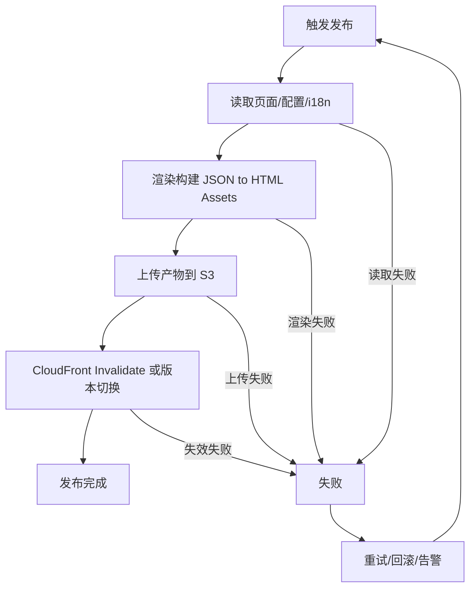

## 部署图

### MVP（Java Backend + Node Preview Worker + S3 CloudFront）

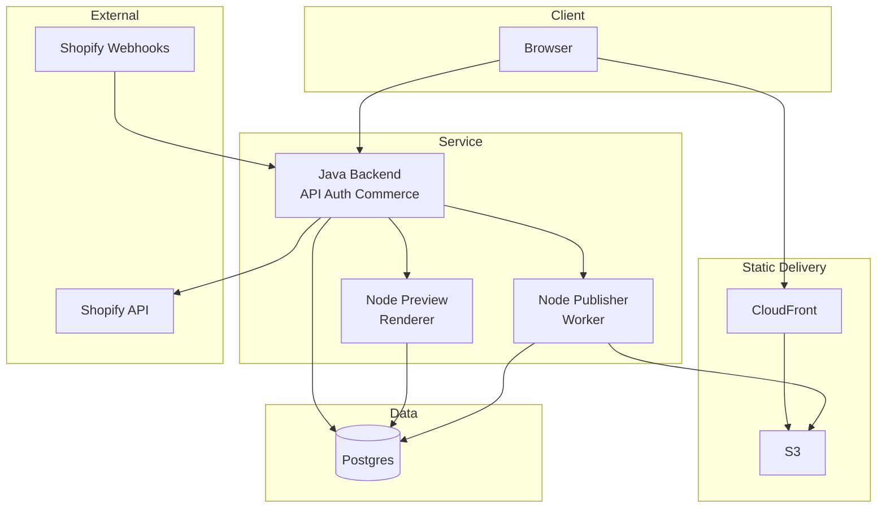

### Scale（Java + Node + Queue Cache）

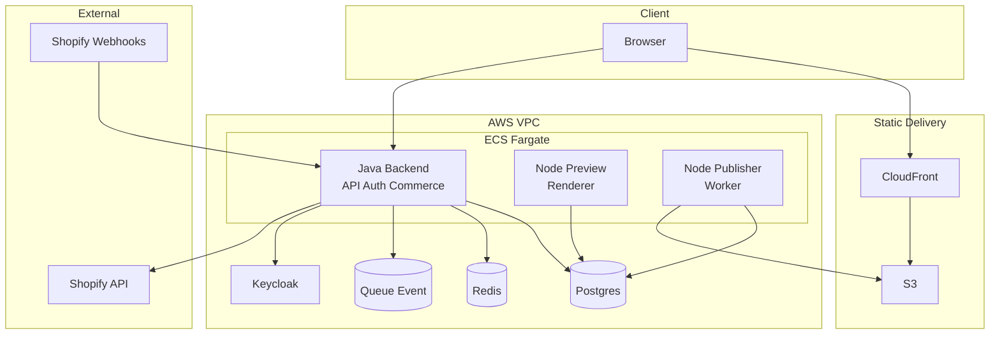

## 逻辑架构
- 前端：Builder/Editor + Admin + Site Runtime（Monorepo，复用 schema 与渲染）
- 后端：Java 模块化单体（可演进微服务）
  - atlas-api（REST + OpenAPI）
  - atlas-builder（编辑协调，预览与发布触发）
  - atlas-commerce（购物车/结算/订单 Webhook）
  - atlas-adapter-shopify（Shopify 适配）
  - atlas-auth（OIDC 集成）
  - atlas-storage（数据库/对象存储抽象）
- 渲染层：Node TypeScript 渲染库，预览与构建复用

## 数据架构
- PostgreSQL（JSONB 存储 Page/Section/Block）
- Redis（缓存，可选）；Queue Event（可选，用于构建触发与异步编排）
- S3（页面产物/媒体）；CloudWatch/Prometheus（日志与指标）

## 部署架构（AWS）
- S3 + CloudFront：静态站点 CDN 分发
- ECS Fargate：Java Backend（对外唯一入口）
- ECS Fargate：Node Preview（常驻）与 Node Worker（弹性）
- Route53/ACM：域名与证书；VPC/IAM/SSM：网络与权限与参数管理

## 运行时约束

* 纯静态发布，前台无 Node Runtime

* 构建并行与失败重试；版本化与精确 Invalidation

* 安全：OIDC（Keycloak）+ RBAC；最小权限 IAM；密钥与参数集中管理

## 与 Shopify 的边界

* 编辑态：实时拉取（限额与退避）；构建态：必要数据 build-time 注入

* 交易与订单由 Shopify 完成；本系统通过 Storefront API/Checkout 跳转与订单 Webhook 实现闭环（查看/购买/Checkout/订单）

## 购物流程（闭环）

1. 产品查看：静态页展示产品信息（来自 Shopify Storefront API）
2. 加入购物车：调用 Commerce API（后端代理 Storefront Cart）
3. 查看购物车：读取 cartId，展示明细与总计/折扣
4. 结算：获取 checkout webUrl 并跳转至 Shopify Checkout 完成支付
5. 订单：后端接收订单 Webhook，持久化摘要；用户可在“订单”页面查询（可选需登录）

## 模块清单与职责

* atlas-api

  * 职责：统一 REST 路由、OpenAPI 文档、认证与鉴权入口、错误处理

  * 部署：Java 应用，随主应用容器部署，水平扩展

* atlas-builder

  * 职责：编辑/预览协调；草稿保存；预览渲染触发与结果回传

  * 部署：随主应用容器部署；预览为常驻服务，无冷启动

* atlas-publisher

  * 职责：构建与发布协调；SQS/Step Functions 编排；产物上传 S3；CloudFront Invalidation

  * 部署：随主应用提供 API；构建执行在独立 ECS Fargate 任务容器

* atlas-adapter-shopify

  * 职责：Shopify Storefront/Admin 客户端；限流与重试；数据缓存；Webhook 注册与校验

  * 部署：随主应用容器部署；与 Redis/SQS 集成

* atlas-commerce

  * 职责：购物车（Cart）、结算（Checkout webUrl）、订单 Webhook 处理与查询

  * 部署：随主应用容器部署；对接 Storefront GraphQL 与 Admin Webhook

* atlas-auth

  * 职责：OIDC/OAuth2 集成（Keycloak）；用户/角色/RBAC；令牌校验与续期

  * 部署：随主应用容器部署；依赖 Keycloak 实例

* atlas-storage

  * 职责：PostgreSQL JSONB 的 DAO 与仓储；Redis 缓存；S3 对象存储抽象；备份与版本管理

  * 部署：随主应用容器部署；对接 EC2 PostgreSQL、ElastiCache、S3

## 部署形态建议

* MVP：Java Backend（ECS）+ Node Preview（ECS 常驻）+ Node Worker（任务）+ Postgres + S3 CloudFront

* Scale：Java + Node + Redis + Queue Event（异步触发与编排）

* 观测：CloudWatch Prometheus OpenTelemetry

## 技术选型（MVP: Java + Node）

* Backend API: Java Backend（Spring Boot 生态）

* Renderer Preview Worker: Node TypeScript

* Database: Postgres JSONB

* Auth: OIDC（Keycloak 或企业 SSO）

## 预览实现选项

* 选项 A：Lambda + TypeScript CLI（低成本、按需、无服务器；适合短时预览）

* 选项 B：ECS Fargate 常驻的 TypeScript 预览服务（无冷启动，适合稳定高并发）

## 更多细节

* 参见后端总体设计文档：[08_后端总体设计.md](./08_后端总体设计.md)

## 迁移与扩展

* 主题迁移：Liquid AST → HTML/Settings → DSL/组件骨架

* 扩展点：Section/Block DSL；渲染器组件解析；发布管线插件化
