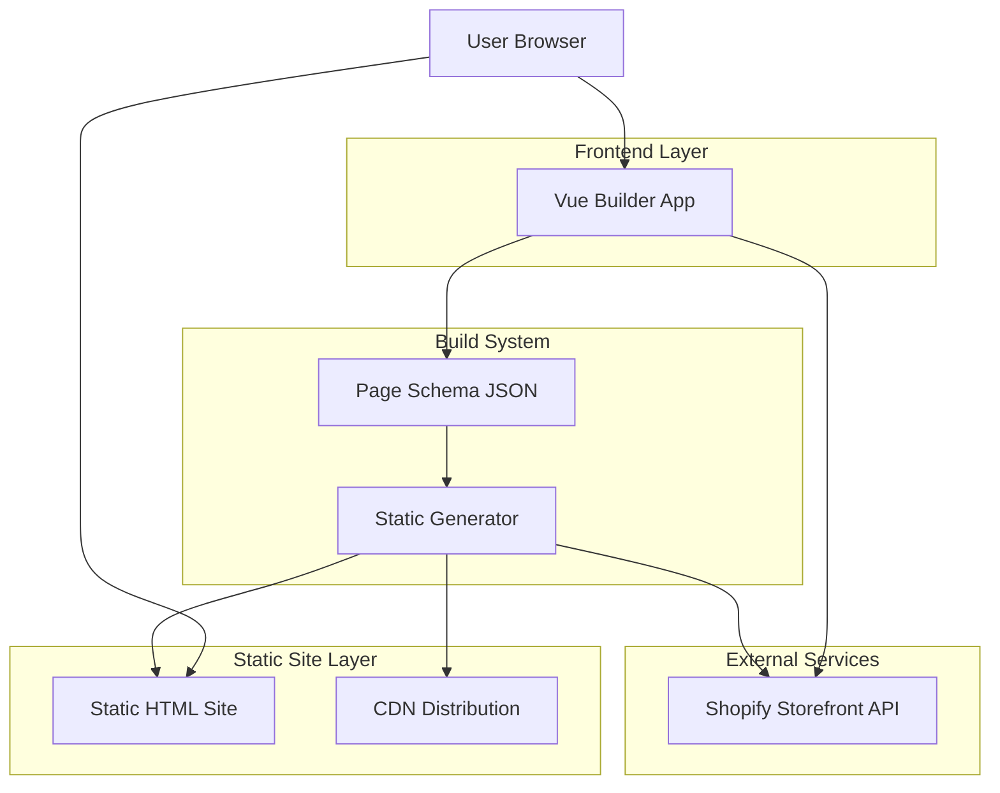
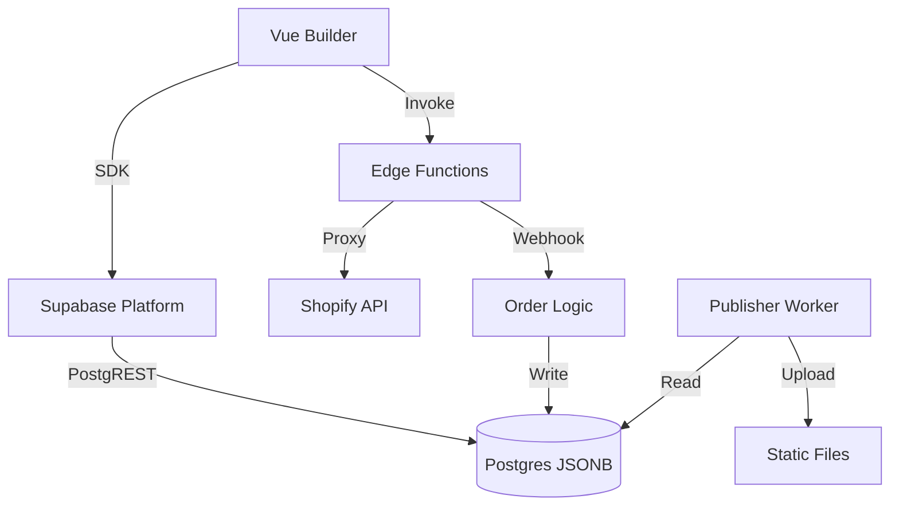

## 1. 架构设计



## 2. 技术描述（MVP: Supabase / Future: NestJS）
- 前端：Vue 3 + Nuxt 3 (or Vite) + TypeScript + TailwindCSS + Pinia（Monorepo：apps 与 packages）
- 构建工具：Vite；仓库管理：pnpm + Turborepo（或 Nx）
- **MVP 后端 (Supabase)**:
  - Database: Supabase Postgres (JSONB)
  - Auth: Supabase Auth
  - API: PostgREST (Auto-generated) + Edge Functions (TypeScript)
  - Publisher: TypeScript CLI (Node) 读取 Supabase DB
- **Future 后端 (NestJS)**:
  - Framework: NestJS (ECS Fargate)
  - Data: Prisma + PostgreSQL (ECS)
  - Orchestration: SQS/EventBridge
- 部署：S3 + CloudFront（静态发布）；ECS Fargate (Publisher Worker)

## 3. 路由定义
| 路由 | 用途 |
|------|------|
| / | 首页（静态HTML） |
| /products/:handle | 产品详情页（静态HTML） |
| /pages/:slug | 内容页面（静态HTML） |
| /editor | 可视化编辑器 (直连 Supabase) |
| /editor/:pageId | 特定页面编辑器 (直连 Supabase) |
| /preview/:pageId | 页面预览 (调用 Edge Functions) |
| /admin | 管理后台 |

## 4. API定义 (MVP)
### 4.1 页面Schema API (Supabase Client)
- 前端直接使用 `supabase.from('pages').select/insert/update/delete`
- 权限控制：Postgres RLS (Row Level Security)

### 4.2 Shopify数据API (Edge Functions)
```
POST /functions/v1/shopify-proxy  # 代理 Storefront API 请求
```

### 4.3 构建API (Edge Functions / Table Trigger)
- 方式 A：前端调用 `supabase.functions.invoke('trigger-build', { pageId })`
- 方式 B：DB 变更触发 Webhook -> Publisher Worker

### 4.4 Commerce API (Edge Functions)
```
POST /functions/v1/cart           # 购物车操作 (Create/Add/Update)
POST /functions/v1/checkout       # 获取 Checkout URL
POST /functions/v1/order-webhook  # 接收 Shopify Webhook
```

## 5. 服务器架构（MVP: Supabase Serverless）


### 5.1 Commerce 服务职责（NestJS）
- Cart Service：创建/读取/更新购物车，维护 cartId 与用户会话映射
- Checkout Service：生成 checkout webUrl 并返回给前端跳转；可附加折扣码/备注
- Order Webhook Handler：接收订单创建/支付成功事件，持久化订单摘要并提供查询
- 安全策略：令牌代理、速率限制、审计日志；不处理支付卡信息

## 6. 数据模型
（同 technical-architecture.md 内容，JSONB 表结构与索引策略）

## 7. 渲染引擎设计
（JSON→AST→组件树→静态HTML，构建期资源优化）

## 8. 构建与部署（AWS）
- 增量构建：页面哈希、关联重建、并行提升效率
- CDN策略：HTML 短 TTL + 版本号；静态资源内容哈希；API 边缘缓存按需
- CI/CD流程：PR → 测试 → 合并 → 构建 → CDN 部署

## 10. 监控与指标
- 日志：pino（结构化日志）；Trace：OpenTelemetry（OTLP）
- 指标：请求 QPS/延迟/错误率；构建时长/成功率；队列积压与重试
- 健康检查：/health、/metrics；错误告警：CloudWatch/Prometheus 规则

## 11. 技术选型决策 (ADR)
### 11.1 前端框架：Vue 3 + Nuxt 3 vs Shopify Hydrogen
**决策**：坚定选择 **Vue 3 + Nuxt 3**。
**背景**：评估了 Shopify 官方推崇的 Hydrogen (React/Remix) 框架。
**拒绝 Hydrogen 的理由**：
1.  **团队匹配度**：团队核心优势在于 Vue 技术栈。切换到 React/Remix 会引入巨大的学习成本，严重拖慢 MVP 交付速度。
2.  **架构演进冲突**：本项目长期目标是演进到自研后端（去 Shopify 化）。Hydrogen 与 Shopify Storefront API 深度耦合，未来迁移成本极高（需重写前端）。Vue 方案保持了架构的松耦合，仅需替换 API 层即可对接 NestJS 自研后端。
3.  **通用性**：Nuxt 3 生态更通用，适合构建复杂的 Headless Builder 和 CMS 系统，而 Hydrogen 专注于纯电商场景。

### 11.2 后端演进：Supabase (MVP) -> NestJS (Enterprise)
**演进路线**：
*   **Phase 1 (MVP)**: 全面使用 Supabase 生态。
    *   **atlas-storage**: Supabase Postgres (JSONB)
    *   **atlas-auth**: Supabase Auth (GoTrue)
    *   **atlas-api**: Supabase Client (PostgREST) + RLS
    *   **atlas-commerce**: Supabase Edge Functions (TypeScript) 代理 Shopify API
*   **Phase 2 (混合)**: 引入 NestJS 中间层。
    *   前端不再直连 Supabase，改为请求 NestJS。
    *   NestJS 负责复杂业务编排，底层仍连接 Supabase DB。
*   **Phase 3 (自研)**: 完全私有化。
    *   数据迁移至自建 RDS/EC2。
    *   Auth 迁移至 Keycloak。

## 9. 性能与缓存
- 构建优化：代码分割、图片优化、关键 CSS
- 运行时优化：静态 HTML 直出、CDN 图片优化、字体预加载
- 缓存策略：浏览器长缓存、CDN 边缘缓存、Service Worker
