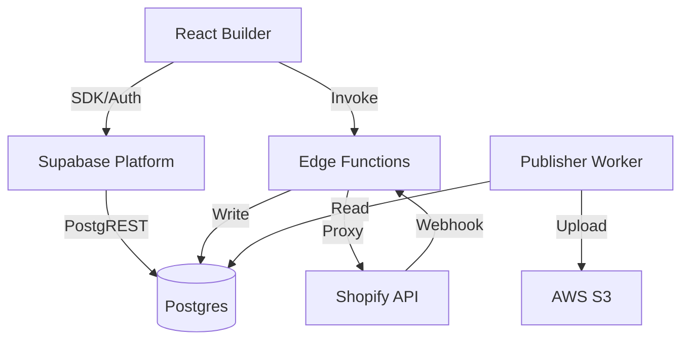

## 决策分析
使用 Supabase 进行 MVP 开发是一个非常务实且高效的选择。它能将后端 CRUD、Auth、数据库运维的工作量压缩 70% 以上，让团队聚焦在 **Builder（编辑器）** 和 **Commerce（电商闭环）** 的核心业务上。

## Supabase MVP 架构方案
*   **核心思路**：利用 Supabase 的 BaaS 能力（Database, Auth, Auto-generated API）解决 90% 的数据存取需求；利用 Edge Functions 解决少量自定义逻辑（Commerce）。

### 1. 模块映射
*   **atlas-storage (数据层)**: **Supabase Postgres**。直接利用 JSONB 存储 Page Schema，无需手写 CRUD API。
*   **atlas-auth (认证)**: **Supabase Auth**。开箱即用，支持邮箱/密码、OAuth，前端 SDK 直接集成。
*   **atlas-api (CRUD)**: **Supabase Client (PostgREST)**。前端 Builder 直接通过 Supabase SDK 读写数据库，配合 **RLS (Row Level Security)** 行级安全策略控制权限。
*   **atlas-commerce (电商)**: **Supabase Edge Functions (TypeScript)**。
    *   作为后端 BFF 层，代理 Shopify Storefront API（购物车/结算）。
    *   处理 Shopify Webhooks（订单状态同步），写入 Supabase 数据库。
*   **atlas-publisher (构建)**: **ECS Task (Node/TS)**。保持不变，从 Supabase 读取数据生成静态 HTML，上传 S3。

### 2. 架构图 (MVP)

## 演进路线（从 MVP 到 Enterprise）
*   **Phase 1 (MVP)**: 全面使用 Supabase 生态。前端直连 DB (RLS)，逻辑在 Edge Functions。
*   **Phase 2 (混合)**: 随着业务逻辑变重，引入 **NestJS** 作为中间层。前端不再直连 Supabase，改为请求 NestJS；NestJS 连接 Supabase DB。Supabase 退化为单纯的托管数据库 + Auth 服务。
*   **Phase 3 (自研/替代)**: 如果需要脱离 Supabase，将 Postgres 数据导出到自建 RDS/EC2，Auth 迁移到 Keycloak，完成完全私有化部署。

## 文档修订计划
1.  **修改 [后端总体设计.md](file:///Users/brucewang/Documents/AIYA/builder/.trae/documents/后端总体设计（从%20Shopify%20到自研电商的演进架构）.md)**:
    *   新增 "MVP 阶段：Supabase Serverless 架构" 章节。
    *   定义 MVP 与后续 NestJS 方案的衔接点。
2.  **修改 [架构设计.md](file:///Users/brucewang/Documents/AIYA/builder/.trae/documents/架构设计.md)**:
    *   更新逻辑架构图，引入 Supabase 模块。
    *   调整 "部署架构"，MVP 阶段减少 ECS 服务数量（只需 Publisher Worker）。
3.  **修改 [技术架构文档.md](file:///Users/brucewang/Documents/AIYA/builder/.trae/documents/技术架构文档.md)**:
    *   更新技术栈描述：NestJS (Future) -> Supabase (MVP)。
    *   更新 API 定义：说明 CRUD 走 Supabase SDK，Commerce 走 Edge Functions。
4.  **修改 [产品路线图.md](file:///Users/brucewang/Documents/AIYA/builder/.trae/documents/产品路线图.md)**:
    *   Phase 1 里程碑调整为 "基于 Supabase 快速交付 MVP"。

确认后，我将立即更新这四份文档，落实 Supabase MVP 方案。