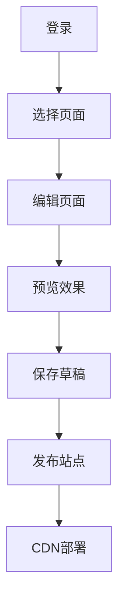

> 状态：已归档（请参考核心文档：架构设计、技术架构文档、后端总体设计）
## 1. 产品概述（Jackery Atlas）

这是一个 **Headless Shopify + 自研可视化 Builder** 的系统（项目名：Jackery Atlas）：

- Shopify 继续负责 Product / Collection / Inventory / Checkout / Payment / Order
- 本系统负责 页面编辑、模板系统、静态站点生成、SEO、性能、CDN

本质上是一个：**"Shopify Compatible Static Site Builder"**（内部基础设施，长期演进）

**核心目标：**

- 100% 可视化编辑（非技术用户）
- 与 Shopify Section / Block / Template 数据结构高度兼容
- 发布后 **纯静态 HTML**（非 SSR）
- 支持大规模站点（多站点 / 多语言 / 多页面）
- SEO / 性能 / 无障碍（WCAG）作为一等公民

## 2. 核心功能

### 2.1 用户角色

| 角色  | 注册方式 | 核心权限           |
| --- | ---- | -------------- |
| 编辑者 | 邮箱注册 | 页面编辑、预览、发布     |
| 管理员 | 邀请注册 | 系统配置、用户管理、站点设置 |

### 2.2 功能模块

系统包含以下核心页面：
1. **编辑器页面**：可视化页面编辑、组件拖拽、实时预览
2. **预览页面**：页面预览、设备适配测试
3. **发布管理**：构建任务管理、发布历史、CDN部署
4. **站点管理**：页面列表、SEO设置、主题配置

### 2.3 页面详情

| 页面名称  | 模块名称  | 功能描述                     |
| ----- | ----- | ------------------------ |
| 编辑器页面 | 组件库   | 提供Section/Block组件拖拽、组件搜索 |
| 编辑器页面 | 画布区域  | 实时预览iframe、组件选中、属性编辑     |
| 编辑器页面 | 属性面板  | 根据选中组件动态生成配置表单           |
| 预览页面  | 设备切换  | 桌面/平板/手机预览模式切换           |
| 发布管理  | 构建任务  | 触发静态构建、查看构建状态            |
| 发布管理  | 发布历史  | 版本回滚、发布记录查看              |
| 站点管理  | 页面列表  | 页面创建、编辑、删除、复制            |
| 站点管理  | SEO设置 | 页面标题、描述、关键词配置            |

## 3. 核心流程

### 编辑者流程
1. 登录系统 → 进入编辑器
2. 选择页面类型（首页/产品页/内容页）
3. 从组件库拖拽Section到画布
4. 在属性面板配置组件属性
5. 实时预览效果 → 保存草稿
6. 发布到CDN → 生成静态站点

## 4. 用户界面设计（UI/UX 规范摘要）

### 4.1 设计风格
- **主色调**：深灰色 (#1a1a1a) + 蓝色 (#0066ff)
- **按钮风格**：圆角矩形，悬停状态变化
- **字体**：系统字体栈，14px基础字号
- **布局风格**：左侧组件库 + 中间画布 + 右侧属性面板
- **图标风格**：简洁线性图标

### 4.2 页面设计

| 页面名称  | 模块名称 | UI元素                  |
| ----- | ---- | --------------------- |
| 编辑器页面 | 组件库  | 左侧边栏，卡片式组件展示，拖拽手柄     |
| 编辑器页面 | 画布区域 | 中央iframe预览，选中高亮边框     |
| 编辑器页面 | 属性面板 | 右侧边栏，表单控件根据schema动态生成 |
| 预览页面  | 设备切换 | 顶部工具栏，设备图标切换          |
| 发布管理  | 构建状态 | 进度条、状态图标、日志输出         |

### 4.3 响应式设计
- 桌面端优先设计
- 编辑器界面固定布局（非响应式）
- 生成的静态站点完全响应式
- 支持触摸设备上的画布操作

## 5. 技术特性（架构摘要）

### 5.1 核心壁垒
- Shopify兼容JSON Schema
- 静态化 + Headless架构
- 非Liquid技术栈
- 可迁移、可替代Shopify Theme

### 5.2 性能要求（MVP 指标）
- 编辑器首次加载 < 3秒
- 静态站点首屏 < 1秒
- 构建时间 < 30秒（单页面）
- CDN全球访问 < 200ms
